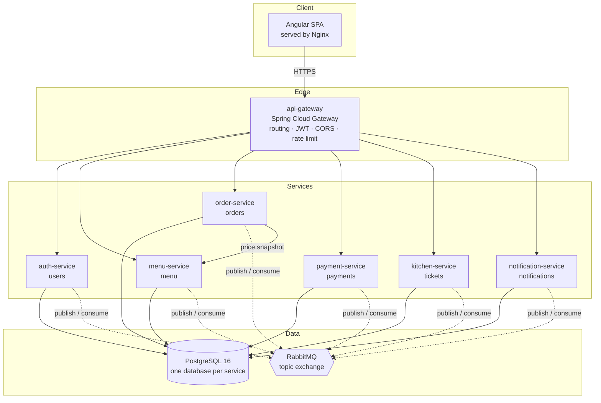
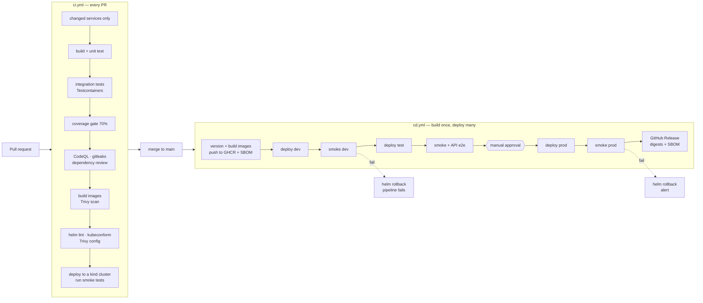

# DineHub Platform

> **Portfolio project. All data, hostnames and credentials are fictitious.**

A restaurant ordering platform built as microservices, with a complete CI/CD
pipeline that builds, tests, scans and deploys to **dev**, **test** and **prod**.

The application is deliberately modest. The delivery and operations around it
are the point: build-once-deploy-many, environment promotion with an approval
gate, automatic rollback on a failed health check, infrastructure as code,
observability, and security scanning at every stage.

[](https://github.com/olivier-ingabire/dinehub-platform/actions/workflows/ci.yml)
[](https://github.com/olivier-ingabire/dinehub-platform/actions/workflows/cd.yml)
[](https://github.com/olivier-ingabire/dinehub-platform/actions/workflows/security-nightly.yml)

---

## Quick start

Requires Docker. Everything else — Maven, the JDK, Node — runs in containers.

```bash
make up
```

Then open <http://localhost>. The menu is seeded and these accounts exist:

| Email | Role | Password |
| --- | --- | --- |
| `customer@dinehub.local` | CUSTOMER | `DineHub2024!` |
| `chef@dinehub.local` | KITCHEN | `DineHub2024!` |
| `admin@dinehub.local` | ADMIN | `DineHub2024!` |

These are seeded only under the `local`, `dev` and `test` profiles. The `prod`
profile excludes the seed migrations entirely — which is why publishing the
password here is safe.

```bash
make test            # unit + integration tests, with the coverage gate
make cluster         # local k3d cluster with dev/test/prod namespaces
make deploy ENV=dev  # helm install into dinehub-dev
make smoke ENV=dev   # end-to-end checks against that environment
make observability-up # Prometheus, Grafana and Loki alongside the stack
make help            # everything else
```

---

## Architecture



**No service discovery server.** Kubernetes Services already provide DNS, health
checking and load balancing; Docker Compose provides the same by container name.
Running Eureka alongside either adds a component to operate for no benefit —
see [ADR 0001](docs/adr/0001-kubernetes-services-over-eureka.md).

**Services never call each other to read state.** They publish events. The one
synchronous call is order-service asking menu-service to price a basket, because
an order must be priced at the moment it is placed and cannot wait for an event.

Detail: [docs/ARCHITECTURE.md](docs/ARCHITECTURE.md).

---

## The pipeline



The same image digest is deployed to all three environments. The job summary and
the release notes both list the digests, so "is prod running what test
approved?" is answered by reading, not by trusting.

Detail, including how this runs without a permanent cluster:
[docs/PIPELINE.md](docs/PIPELINE.md).

---

## Observability

```bash
make observability-up      # Grafana :3000, Prometheus :9090, alongside `make up`
```

Prometheus scrapes every service, Promtail ships container logs into Loki, and
Grafana is provisioned from JSON in the repository — four dashboards (service
overview, JVM and runtime, business, delivery and release health) and seventeen
alert rules, each carrying an `action` annotation so an alert says what to do
rather than only what is wrong.

The piece worth knowing about: every service puts a `traceId` in the MDC and
returns it on error responses, Promtail attaches it as structured metadata, and
the Loki datasource turns it into a link. A customer quotes the id from an error
page and

```
{environment="dev"} | traceId=`3f9c1e02…`
```

returns every line that request produced, in every service that touched it.

[observability/README.md](observability/README.md) has the conventions — why
colour means state and never identity, why there is never a second y-axis, and
where cardinality is actively managed.

---

## What has actually been run

Claims in a portfolio repository are cheap, so these were checked rather than
asserted, and the things that turned out to be false were fixed:

| Claim | How it was checked |
| --- | --- |
| The platform works end to end | 19/19 end-to-end and 16/16 smoke checks, against Compose **and** against a Kubernetes cluster with NetworkPolicies enforced |
| A failed release rolls back | A release with an unsatisfiable readiness probe was deployed on purpose. It did **not** roll back the first time — [ADR 0006](docs/adr/0006-maxunavailable-zero.md) — and does now, verified on every CI run |
| NetworkPolicies isolate the services | `deploy/scripts/verify-network-policies.sh`, 7/7. It probes from fresh pods, because an established connection hides a missing rule — which is how a missing broker policy went unnoticed |
| Containers are hardened | All 11 run non-root with a read-only root filesystem; Trivy reports zero HIGH or CRITICAL — after being made to read the Helm chart, which it had been silently skipping |
| The dashboards show something | Every query executed against a live Prometheus. The latency panels returned nothing, because the services were exporting summaries rather than histograms |
| Logs are searchable by trace | One traceId returned ten lines across four services, and the Loki label index holds only the six bounded labels it should |

---

## Repository layout

```
services/            Spring Boot services, one module each, plus a small shared library
web/                 Angular app, served by Nginx
deploy/
  docker-compose.yml Full local stack
  helm/              Umbrella chart + one values file per environment
  k8s/bootstrap/     Namespaces, ingress, platform components
  scripts/           Cluster creation, smoke tests, rollback
observability/       Prometheus + alerts, Grafana dashboards and provisioning,
                     Loki, Promtail, Alertmanager, and a Compose overlay to run them
.github/workflows/   ci.yml, cd.yml, security-nightly.yml
docs/                Architecture, pipeline, environments, runbooks, ADRs
```

---

## Environments

| | dev | test | prod |
| --- | --- | --- | --- |
| Trigger | automatic on merge | automatic after dev smoke passes | manual approval |
| Replicas | 1 | 1 | 2 + PodDisruptionBudget |
| Seed data | yes | yes | **no** |
| Swagger UI | on | on | off |
| HPA | no | no | yes, on order-service |
| DB backup | no | no | nightly CronJob, 7-day retention |

Every difference comes from a Helm values file. The images, the charts and the
code are identical. [docs/ENVIRONMENTS.md](docs/ENVIRONMENTS.md).

---

## Documentation

| Document | What it covers |
| --- | --- |
| [ARCHITECTURE.md](docs/ARCHITECTURE.md) | Services, data ownership, event flow, the choices that were contested |
| [PIPELINE.md](docs/PIPELINE.md) | Every stage, the quality gates, Modes A and B, GitHub setup |
| [ENVIRONMENTS.md](docs/ENVIRONMENTS.md) | What differs per environment and how to add one |
| [RELEASE_RUNBOOK.md](docs/RELEASE_RUNBOOK.md) | Releasing to production, with pre- and post-checks |
| [ROLLBACK_RUNBOOK.md](docs/ROLLBACK_RUNBOOK.md) | Automatic and manual rollback, and database migrations |
| [INCIDENT_RUNBOOK.md](docs/INCIDENT_RUNBOOK.md) | Triage using the dashboards and logs |
| [SECURITY.md](SECURITY.md) | How secrets are handled in each environment |
| [observability/README.md](observability/README.md) | The metrics, dashboards and logging stack, and the conventions behind them |
| [adr/](docs/adr/) | Why Kubernetes Services over Eureka, build-once, namespaces, RabbitMQ, database-per-service, and why `maxUnavailable` is zero |

---

## Screenshots

<!-- Replace these placeholders once the pipeline has run against your fork. -->

| | |
| --- | --- |
| Pipeline run | `docs/images/pipeline-run.png` |
| Grafana service overview | `docs/images/grafana-overview.png` |
| Grafana business metrics | `docs/images/grafana-business.png` |
| The application | `docs/images/app-order-flow.png` |

---

## Licence

[MIT](LICENSE).
