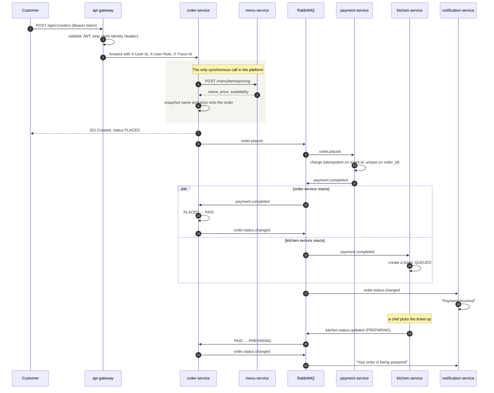

# Architecture

> Portfolio project. All data, hostnames and credentials are fictitious.

Seven services, one database each, communicating by events except where an
answer is needed synchronously.

---

## Services and data ownership

| Service | Owns | Publishes | Consumes |
| --- | --- | --- | --- |
| `api-gateway` | nothing | — | — |
| `auth-service` | `users` | `user.registered` | — |
| `menu-service` | `categories`, `menu_items` | `menu.item.updated` | — |
| `order-service` | `orders`, `order_items` | `order.placed`, `order.cancelled`, `order.status.changed` | `payment.completed`, `payment.failed`, `kitchen.status.updated` |
| `payment-service` | `payments` | `payment.completed`, `payment.failed` | `order.placed` |
| `kitchen-service` | `kitchen_tickets` | `kitchen.status.updated` | `payment.completed`, `order.cancelled` |
| `notification-service` | `notifications` | — | `order.status.changed`, `user.registered` |

**No service reads another's tables.** Each has a credential that can reach only
its own database, so a cross-domain query fails with a permission error during
development rather than succeeding and silently creating coupling. See
[ADR 0005](adr/0005-database-per-service.md).

**`notification-service` is a leaf.** It publishes nothing, so nothing downstream
can depend on a notification having been sent, and the service can be down
without blocking anything.

---

## Placing an order



Three things in that diagram are deliberate and worth stating:

**The customer gets their 201 before payment runs.** Waiting would make the
response as slow as the payment provider and would couple the order endpoint's
availability to payment-service's. The order is `PLACED` for a moment and then
becomes `PAID`; the UI shows that honestly rather than pretending it is instant.

**Prices are snapshotted, not referenced.** `order_items` stores the name and
unit price as they were at the moment of ordering. Joining to the live menu would
mean a later price change rewrote historic orders, which is wrong for anything
with a financial record.

**kitchen-service reacts to `payment.completed`, not `order.placed`.** Cooking
food that has not been paid for is a mistake that only has to happen a few times
to matter.

---

## The one synchronous call

`order-service → menu-service` to price a basket. Everything else is an event.

It is synchronous because an order must be priced at the moment it is placed, and
the customer is waiting for the total. The cost is accepted and bounded:

- A 3-second timeout, configured explicitly. The defaults are effectively
  infinite, so a menu-service that accepts the connection and then stops
  responding would hold a thread indefinitely.
- A clear 503-shaped error rather than a hang.
- It is the one place where menu-service being down stops orders being placed,
  and that is documented here rather than discovered during an incident.

---

## Events

One RabbitMQ topic exchange, `dinehub.events`. Routing keys are hierarchical —
`order.placed`, `order.cancelled`, `order.status.changed` — so a consumer can
bind to `order.*` and receive the family. That is the reason for a topic exchange
rather than a direct one.

### At-least-once delivery, and what it costs

RabbitMQ guarantees a message is delivered **at least** once. Every consumer will
eventually see a duplicate — most often during a redeploy, when unacknowledged
messages are redelivered to the replacement pod. For `payment.completed` that
means charging twice.

Two defences, because one is not enough:

1. **An idempotency ledger.** Every service has a `processed_events` table keyed
   on the event id. `IdempotencyService` claims the id in its own transaction
   before the handler runs, so the database primary key decides a race between
   two pods rather than an application check with a gap in it.
2. **Domain constraints.** `payments.order_id` is unique;
   `kitchen_tickets.order_id` is unique. These catch the case the ledger cannot —
   two genuinely different events for the same order.

### Failed messages

Every queue dead-letters after three attempts with exponential backoff. The
dead-letter queue is alerted on when non-empty, which is the difference between a
lost event and a known one. Nothing deletes from it automatically.

### Lost events

A message can be lost outright — a broker restart at the wrong moment, a consumer
that crashed between acknowledging and committing. Nothing reports that: no
exception, no dead-lettered message, just an order that stops moving.

`StuckOrderSweep` in order-service runs every two minutes and exports a gauge of
orders that have not progressed within a threshold. The alert on that gauge is
what gets a human to look. It deliberately does not try to repair anything —
automatically re-driving a payment would be worse than the problem.

---

## Request identity and tracing

```
Browser ──▶ gateway ──▶ service ──▶ RabbitMQ ──▶ another service
            │           │                        │
            └── one X-Trace-Id follows all of it ┘
```

The gateway generates a trace id (or reuses the client's), puts it on the
downstream request, and every service puts it in the MDC so it appears on every
log line. Event payloads carry it too, so an asynchronous hop does not break the
chain.

The practical consequence: a user quotes the trace id from an error message, and
one Loki query returns everything that happened — across six services and two
queue hops.

### Identity

The gateway validates the JWT and passes `X-User-Id`, `X-User-Role` and
`X-User-Email` downstream. **It strips those headers from the incoming request
first.** Without that strip, impersonating an admin is one `curl -H` away.

Services validate the token themselves as well. That duplication is deliberate: a
request reaching a service by any route other than the gateway is still
authenticated. The NetworkPolicies make that route hard to find; the token check
makes it useless.

---

## Why these choices

Recorded as decision records, with the alternatives and why they were rejected:

| Decision | Record |
| --- | --- |
| Kubernetes Services instead of Eureka | [ADR 0001](adr/0001-kubernetes-services-over-eureka.md) |
| Build once, deploy the same digest everywhere | [ADR 0002](adr/0002-build-once-deploy-many.md) |
| One cluster, a namespace per environment | [ADR 0003](adr/0003-namespace-per-environment.md) |
| RabbitMQ for domain events | [ADR 0004](adr/0004-rabbitmq-for-domain-events.md) |
| A database per service | [ADR 0005](adr/0005-database-per-service.md) |

---

## The shared module

`services/common` holds the error contract, the event vocabulary, JWT handling,
the trace filter and the idempotency ledger. It is deliberately small: a shared
module that grows without limit becomes a distributed monolith's shared database,
and every service then redeploys when it changes.

It has one cost worth knowing about. Spring Boot derives entity and repository
scanning from the package of the `@SpringBootApplication` class, not from
`scanBasePackages`, so every service states both explicitly:

```java
@EntityScan(basePackages = {"com.dinehub.order.entity", "com.dinehub.common.messaging"})
@EnableJpaRepositories(basePackages = {"com.dinehub.order.repository", "com.dinehub.common.messaging"})
```

Without those two lines the shared `processed_events` entity is invisible and the
service fails at startup — not at compile time. That is the price of putting
Spring components in a library, and it is paid once per service.

---

## What this architecture does not do

Stated plainly, because a document that implies more than it delivers is worse
than a modest one:

- **No distributed transactions, and no saga orchestrator.** A failed payment
  cancels the order through an event, which is a choreographed saga in the loose
  sense, but there is no compensation framework. A genuinely partial failure —
  payment taken, order lost — would need manual reconciliation.
- **No read models or CQRS.** Every query hits the owning service's tables
  directly.
- **No event sourcing.** Events are notifications, not the source of truth. They
  are not replayable, which is the main thing RabbitMQ gives up relative to Kafka.
- **No rate limiting per tenant,** because there are no tenants.
- **The payment provider is simulated.** Said plainly rather than dressed up: the
  value here is that the failure path is reachable on demand, so the cancellation
  flow, the notification and the alert are exercised rather than being code
  nobody has ever seen run.
