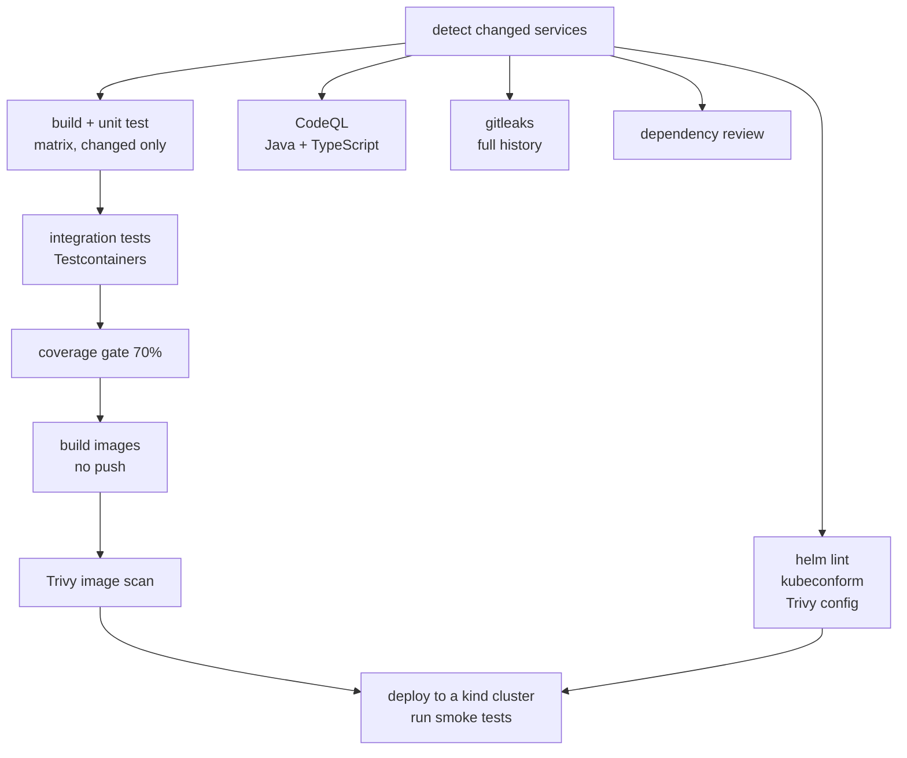
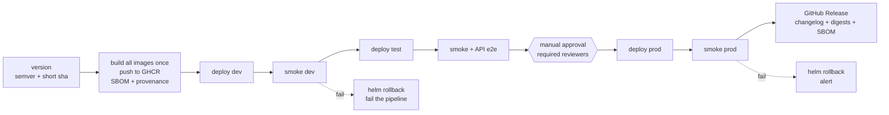

# Pipeline

Two workflows and a nightly scan. The governing principle is **build once, deploy
the same image digest everywhere** — see
[ADR 0002](adr/0002-build-once-deploy-many.md).

---

## Pull request — `ci.yml`

Runs on every pull request to `main`. All jobs must pass before merge; branch
protection enforces it.



| Stage | Fails the build on |
| --- | --- |
| Build and unit test | Any compilation error or test failure |
| Integration tests | Any Testcontainers test failure |
| Coverage | JaCoCo line coverage below 70% for any module |
| CodeQL | Any alert |
| gitleaks | Any secret anywhere in the history |
| Dependency review | A new high-severity advisory |
| Trivy image scan | CRITICAL **with a fix available** |
| Helm lint / kubeconform | Invalid chart or manifest |
| Trivy config scan | HIGH and above in a chart or Dockerfile |
| Ephemeral deploy | The chart does not deploy, or smoke tests fail |

**Why "CRITICAL with a fix available" rather than all CRITICALs.** Failing on
unfixable findings makes the pipeline red for reasons nobody can act on, and
people learn to merge past it — at which point it catches nothing. Unfixable
CRITICALs are reported in the job summary and tracked, not used as a gate.

**Why the ephemeral deploy matters most.** Everything above it tests the code.
This tests the *release*: a kind cluster is created inside the runner, the whole
chart is deployed with `values-dev.yaml`, and `smoke-test.sh` runs against it. A
chart that renders fine and does not actually come up is caught here, in a pull
request, rather than in dev.

**Changed services only.** A path filter drives a matrix, so a change to
menu-service does not rebuild and retest seven services. The shared `common`
module is treated as affecting everything, because it does.

---

## Delivery — `cd.yml`

Runs on push to `main`.



### Versioning

`<semver>-<short-sha>`, for example `1.4.0-a3f91c2`. Images are tagged with that
and with the full commit SHA. **Never only `latest`** — a `latest` tag makes
"what is running in production?" unanswerable and a rollback ambiguous.

### Deployment

```bash
helm upgrade --install dinehub deploy/helm/dinehub \
  --namespace "dinehub-${ENV}" \
  --values "deploy/helm/values-${ENV}.yaml" \
  --set global.image.tag="${VERSION}" \
  --atomic --wait --timeout 10m
```

`--atomic` is the important flag: if the release does not become healthy within
the timeout, Helm rolls it back itself. Without it a failed deploy leaves the
namespace in a half-updated state that somebody has to untangle by hand.

### Automatic rollback

Smoke tests run after every deployment. On failure the job runs
`helm rollback` and then fails, so the pipeline is red *and* the environment is
serving the previous release. The two are separate outcomes and both matter —
a green pipeline over a broken environment is the worst case.

### The approval gate

Production uses a GitHub Environment with required reviewers. The job summary the
reviewer sees carries the version, the commit list since the last production
release, and the test results — enough to decide without opening three other tabs.

### The release record

A GitHub Release is created with the version, a changelog generated from the
commits, the image **digests** (not tags) and links to the SBOMs. The digests are
what make "is production running what test approved?" a question you answer by
reading rather than by trusting.

---

## Running without a permanent cluster

GitHub-hosted runners cannot reach a cluster on a laptop. Both modes are
supported and the workflow picks automatically.

### Mode A — ephemeral clusters (the default)

If `KUBECONFIG_<ENV>` is not set, each deploy job creates a kind cluster inside
the runner, deploys that environment's namespace, and runs the smoke tests.

The full dev → test → approval → prod flow goes green on free runners. What it
demonstrates is real: the charts, the values, the promotion order, the approval
gate, the smoke tests and the rollback all execute. What it does not demonstrate
is persistence — each environment is a fresh cluster, so there is no state
carried between deployments and no genuine upgrade-in-place.

### Mode B — real persistent environments

A self-hosted runner on a machine with a k3d cluster created by
`create-local-cluster.sh`. Deploy jobs then use the real `dinehub-dev`,
`dinehub-test` and `dinehub-prod` namespaces, and deployments are genuine
rolling upgrades over existing state.

```bash
./deploy/scripts/create-local-cluster.sh
kubectl config view --raw --minify --flatten > kubeconfig-dev.yaml
# Add the contents as the KUBECONFIG_DEV secret, repeat per environment.
```

The workflow needs no change: the presence of the secret selects the mode.

---

## GitHub setup

### Environments

Settings → Environments. Create `dev`, `test` and `prod`.

| Environment | Protection |
| --- | --- |
| `dev` | none |
| `test` | none |
| `prod` | required reviewers; optionally restrict to `main` |

### Secrets

| Secret | Scope | Used for |
| --- | --- | --- |
| `KUBECONFIG_DEV` / `_TEST` / `_PROD` | per environment | Mode B only; absent means Mode A |
| `JWT_SECRET` | per environment | Creating the JWT Kubernetes Secret at deploy time |
| `DB_PASSWORD` | per environment | Creating the database Secret at deploy time |

`GITHUB_TOKEN` is used for GHCR; no separate registry credential is needed.

**A different `JWT_SECRET` per environment** is not optional. A shared signing key
means a token issued by dev is accepted by production.

### Branch protection on `main`

Require: pull request review, all `ci.yml` checks passing, branches up to date,
and no force pushes.

---

## Pipeline quality

- **Reusable workflows** for the repeated parts. The three deploy jobs call one
  reusable workflow with different inputs rather than being three copies that
  drift apart.
- **Caching** for Maven (`~/.m2`), npm and Docker layers (GitHub Actions cache).
- **Concurrency groups** per environment, so two deploys to the same namespace
  can never run at once and a stale one does not overwrite a newer one.
- **Least-privilege `permissions:`** declared on every workflow. The default is
  read-only; `packages: write` and `id-token: write` are granted only on the job
  that needs them.
- **Actions pinned** to a specific version, with Dependabot keeping them current.
  An unpinned action is remote code executed with the repository's token.
- **A job summary** on every run, giving the version, the environments deployed,
  the test results and the scan findings — so the common case needs no log diving.

---

## When the pipeline fails

| Symptom | Usual cause | Where to look |
| --- | --- | --- |
| Coverage gate fails | New code without tests | The JaCoCo report artefact; the gate excludes only pure bean declarations |
| Trivy fails on a base image | A new CVE with a fix | Bump the base image; Dependabot usually has the PR already |
| gitleaks fails | A secret committed, possibly long ago | It scans the **full history** — rotate the secret, then rewrite history |
| Ephemeral deploy times out | A probe misconfigured, or an image that will not start | `kubectl describe pod` output is in the job log |
| Smoke tests fail on dev but not locally | Configuration that differs per environment | Compare the values file against `values-dev.yaml` |
| Prod deploy waits forever | Nobody has approved it | Settings → Environments → prod → reviewers |

Runbooks: [RELEASE_RUNBOOK.md](RELEASE_RUNBOOK.md),
[ROLLBACK_RUNBOOK.md](ROLLBACK_RUNBOOK.md),
[INCIDENT_RUNBOOK.md](INCIDENT_RUNBOOK.md).
